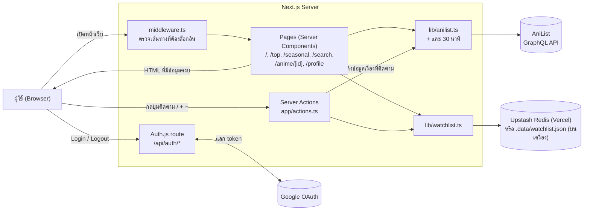
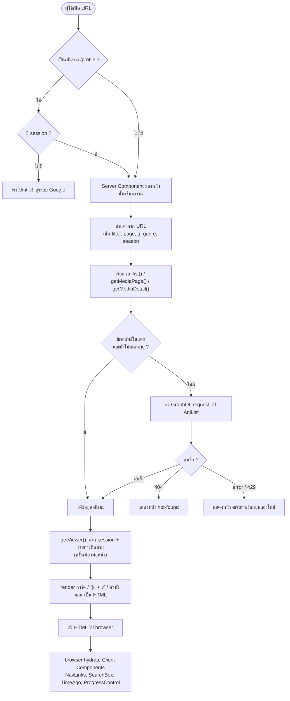
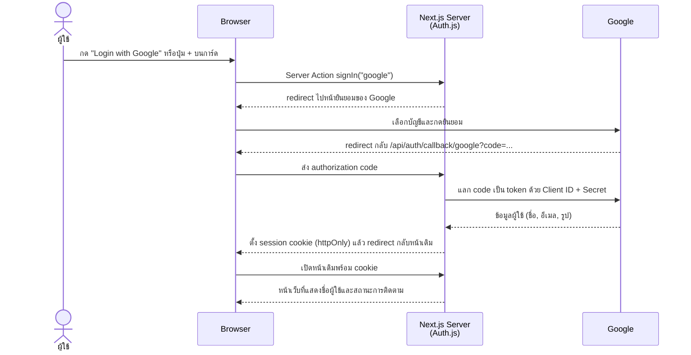
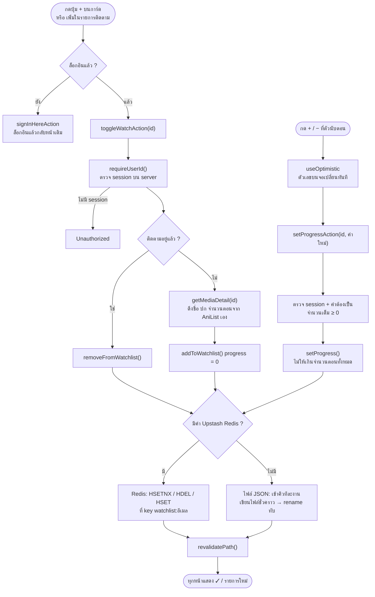
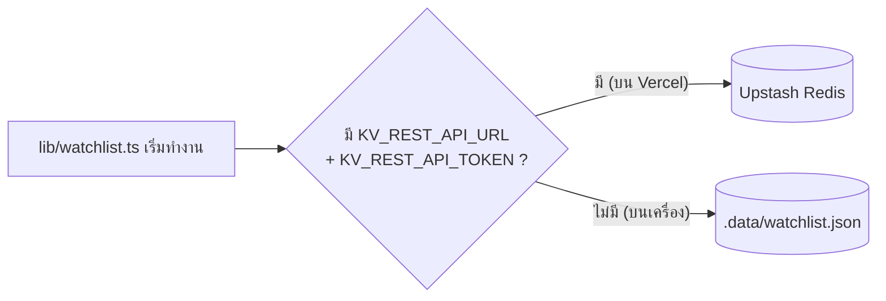

# AniExplorer

เว็บฐานข้อมูลอนิเมะ หน้าตาสไตล์ AniList สร้างด้วย **Next.js 15 (App Router) + React 19 + TypeScript** ดึงข้อมูลจาก [AniList GraphQL API](https://graphql.anilist.co) มีระบบเข้าสู่ระบบด้วย **Google OAuth** ผ่าน Auth.js และเก็บรายการติดตามใน **Upstash Redis** (deploy บน Vercel)

🔗 เว็บจริง: **https://project-webtech-rust.vercel.app**

## ผู้จัดทำ

| รหัสนักศึกษา | ชื่อ-สกุล |
|---|---|
| 6804101317 | นายชินดนัย มหาวรรณ |
| 6804101333 | นายธนกฤต ณ ลำพูน |
| 6804101355 | นายนัฐภัทร การดี |
| 6804101371 | นายยศกร สิงค์เจริญ |
| 6804101377 | นายวรวรรธน์ เจริญวงค์ |

## ฟีเจอร์

- **หน้าแรก** – hero banner ของเรื่องที่มาแรงที่สุด และ 3 แถว ได้แก่ Trending Now, Popular This Season และ Recently Aired (ตอนที่เพิ่งออกอากาศ พร้อมบอกว่าออกมากี่นาที/ชั่วโมงแล้ว) ชี้เมาส์ที่การ์ดเพื่อดูคะแนน สตูดิโอ และแนว
- **Top Anime** – การ์ดจัดอันดับพร้อมคะแนนเป็น % และแถบสี กรองได้ตาม All / Top Airing / TV / Movie / OVA / ONA / Most Popular / Most Favorited
- **Seasonal Anime** – อนิเมะแยกตามซีซัน เลื่อนดูซีซันก่อนหน้าและถัดไปได้ และจัดกลุ่มตามรูปแบบ (TV, ONA, Movie ฯลฯ)
- **ค้นหาแบบเห็นผลทันที** – พิมพ์ในช่องค้นหาบน navbar แล้วผลลัพธ์ (ปก ชื่อ รูปแบบ ปี คะแนน) จะขึ้นใต้ช่องทันที เลือกด้วยเมาส์หรือปุ่ม ↑ ↓ + Enter ได้
- **ตารางฉาย (Schedule)** – ปุ่มเลือกวัน 7 วัน (วันนี้, พรุ่งนี้ ...) แสดงตอนที่ออกอากาศเรียงตามเวลาประเทศไทย พร้อมนับถอยหลังและปุ่มติดตาม
- **ค้นหา (Browse)** – ค้นจากชื่อเรื่อง กรองตามแนว และเรียงลำดับได้ ถ้ายังไม่ได้ค้นจะแสดงปุ่มแนวให้เลือก
- **หน้ารายละเอียด** – ภาพ banner, การ์ดสถิติ (คะแนน อันดับ ผู้ติดตาม คนที่ชื่นชอบ), ข้อมูลเรื่อง, เรื่องที่เกี่ยวข้อง, ตัวละครและนักพากย์, ตัวอย่าง (YouTube) และเรื่องแนะนำ
- **เข้าสู่ระบบด้วย Google** – ปุ่ม Login / Logout บน navbar และหน้า `/profile` ที่ต้องล็อกอินก่อนจึงจะเข้าได้ แสดงสถิติ (กำลังติดตาม, ตอนที่ดูแล้ว, ดูจบแล้ว)
- **รายการติดตาม** – ผู้ใช้ที่ล็อกอินแล้วกดติดตามอนิเมะได้ทั้งจากปุ่ม **+** บนการ์ดทุกหน้า และจากหน้ารายละเอียด แล้วดูหรือเลิกติดตามได้ที่หน้า `/profile`
- **นับตอนที่ดู** – เรื่องที่ติดตามอยู่กด **−** / **+** เพื่อลดหรือเพิ่มตอนที่ดูแล้วได้ มีแถบความคืบหน้า และขึ้น “ดูจบแล้ว” เมื่อครบทุกตอน
- **Navbar** – ติดด้านบนตลอดเวลาที่เลื่อนหน้า ไฮไลต์เมนูของหน้าที่เปิดอยู่ มีช่องค้นหาและปุ่มล็อกอิน
- **ระหว่างโหลด / เมื่อผิดพลาด** – แสดงโครงการ์ดกระพริบ (skeleton) ระหว่างรอข้อมูล และมีหน้า 404 / Error พร้อมปุ่มกลับหน้าแรกหรือลองใหม่
- รองรับโหมดสว่างและมืดตามการตั้งค่าของระบบ และแสดงผลได้บนมือถือ

## สิ่งที่ต้องมี

- [Node.js](https://nodejs.org) เวอร์ชัน 18.18 ขึ้นไป (แนะนำ 20 หรือใหม่กว่า)
- บัญชี Google สำหรับสร้าง OAuth credential (ใช้เฉพาะระบบล็อกอิน)

## การติดตั้ง

### 1. ติดตั้งแพ็กเกจ

```bash
cd anime-explorer
npm install
```

### 2. สร้าง OAuth credential ใน Google Cloud Console

1. เข้า [console.cloud.google.com](https://console.cloud.google.com) แล้วสร้างหรือเลือกโปรเจกต์
2. ไปที่ **APIs & Services → OAuth consent screen** เลือกชนิด **External** แล้วกรอกข้อมูลให้ครบ
   - ระหว่างที่แอปอยู่ในสถานะ **Testing** ให้เพิ่มอีเมลที่จะใช้ทดสอบในหัวข้อ **Test users**
3. ไปที่ **Credentials → Create Credentials → OAuth client ID** เลือกชนิด **Web application**
4. ตั้งค่าดังนี้

   | ช่อง | ค่า |
   |---|---|
   | Authorized JavaScript origins | `http://localhost:3000` |
   | Authorized redirect URIs | `http://localhost:3000/api/auth/callback/google` |

   > redirect URI ต้องตรงทุกตัวอักษร รวมถึงพอร์ต ถ้ารันบนพอร์ตอื่นหรือ deploy ขึ้นโดเมนจริง ต้องเพิ่ม URI ของพอร์ตหรือโดเมนนั้นด้วย หลังบันทึกอาจต้องรอ 5 นาทีถึงไม่กี่ชั่วโมงกว่าการตั้งค่าจะมีผล

5. กด **Create** แล้วคัดลอก **Client ID** และ **Client Secret** ไว้

### 3. ตั้งค่า Environment Variables

คัดลอกไฟล์ตัวอย่างเป็น `.env.local`

```bash
cp .env.example .env.local
```

จากนั้นแก้ค่าใน `.env.local`

```env
AUTH_SECRET=<ค่าสุ่มที่ยาวและคาดเดายาก>
AUTH_GOOGLE_ID=<Google Client ID>
AUTH_GOOGLE_SECRET=<Google Client Secret>
```

สร้างค่า `AUTH_SECRET` ได้ด้วยคำสั่งใดคำสั่งหนึ่งต่อไปนี้

```bash
openssl rand -base64 32
```

```bash
npx auth secret
```

ถ้าอยากให้เครื่องตัวเองใช้ Upstash Redis เดียวกับเว็บจริง ให้เพิ่ม `KV_REST_API_URL` และ `KV_REST_API_TOKEN` (ดูค่าได้จากหน้า Storage ของ Vercel) ถ้าไม่ใส่ จะเก็บรายการติดตามในไฟล์ `.data/watchlist.json` แทน

> **ห้าม commit `.env.local` ขึ้น git** (ไฟล์นี้อยู่ใน `.gitignore` แล้ว) และห้ามนำ Client Secret ไปใช้ในโค้ดฝั่ง client

## การใช้งาน

### รันโหมดพัฒนา

```bash
npm run dev
```

เปิด [http://localhost:3000](http://localhost:3000) ในเบราว์เซอร์ เมื่อแก้โค้ด หน้าเว็บจะรีโหลดให้เอง (ถ้าแก้ `.env.local` ให้รีสตาร์ท server)

### Build และรันโหมด production

```bash
npm run build
```

```bash
npm start
```

> อย่ารัน `npm run build` ขณะที่ `npm run dev` ยังทำงานอยู่ เพราะทั้งสองคำสั่งใช้โฟลเดอร์ `.next` ร่วมกัน ถ้าเผลอทำไปแล้ว ให้หยุด dev server ลบโฟลเดอร์ `.next` แล้วรันใหม่

### หน้าต่าง ๆ ในเว็บ

| เส้นทาง | คำอธิบาย |
|---|---|
| `/` | หน้าแรก: hero banner, Trending Now, Popular This Season, Recently Aired |
| `/top?filter=airing` | อันดับอนิเมะ (`filter`: `all`, `airing`, `tv`, `movie`, `ova`, `ona`, `bypopularity`, `favorite`) |
| `/seasonal?year=2026&season=fall` | อนิเมะตามซีซัน (`season`: `winter`, `spring`, `summer`, `fall`) |
| `/search?q=frieren&genre=Fantasy&sort=score` | ค้นหา / Browse (`sort`: `popularity`, `score`, `trending`, `newest`, `title`) |
| `/schedule?day=0` | ตารางฉาย (`day`: `0` = วันนี้, `1` = พรุ่งนี้ ... `6`) |
| `/anime/[id]` | รายละเอียดอนิเมะ ใช้ id เดียวกับ AniList เช่น `/anime/16498` |
| `/profile` | หน้าโปรไฟล์ สถิติ และรายการติดตาม (ต้องล็อกอิน) |

เมนูบน navbar: **Home** → `/`, **Top Anime** → `/top`, **Seasonal** → `/seasonal`, **Schedule** → `/schedule`, **Browse** → `/search` ส่วนช่องค้นหาบน navbar แสดงผลทันทีระหว่างพิมพ์ และกด Enter เพื่อไป `/search?q=...`

### การเข้าสู่ระบบ

1. กด **Login with Google** ที่มุมขวาของ navbar
2. เลือกบัญชี Google แล้วกดยินยอม
3. เมื่อสำเร็จ มุมขวาบนจะแสดงชื่อและรูปโปรไฟล์ กดชื่อเพื่อไปหน้า `/profile` และกด **Logout** เพื่อออกจากระบบ

ถ้ายังไม่ได้ล็อกอินแล้วเข้า `/profile` ระบบจะพาไปหน้าเข้าสู่ระบบก่อน

### รายการติดตาม

1. ล็อกอินด้วย Google (ถ้ายังไม่ล็อกอินแล้วกดปุ่มติดตาม ระบบจะพาไปล็อกอินก่อน แล้วกลับมาหน้าเดิม)
2. กดติดตามได้ 2 ทาง
   - **บนการ์ด** (หน้าแรก, Top Anime, ค้นหา, Seasonal Anime) – ชี้เมาส์ที่การ์ดแล้วกดปุ่ม **+** ที่มุมขวาบนของปก (บนมือถือปุ่มแสดงตลอด) เมื่อติดตามแล้วจะเปลี่ยนเป็น **✓** สีเขียว กดอีกครั้งเพื่อเลิกติดตาม
   - **ในหน้ารายละเอียด** – กด **+ เพิ่มในรายการติดตาม** ใต้ปกด้านบนของหน้า กดอีกครั้งที่ **✓ กำลังติดตาม** เพื่อเลิกติดตาม
3. กดชื่อของคุณที่มุมขวาของ navbar เพื่อไปหน้า `/profile` ด้านบนเป็นการ์ดโปรไฟล์พร้อมสถิติ ด้านล่างเป็นเรื่องที่ติดตามทั้งหมด เรียงจากที่เพิ่มล่าสุด กด **เลิกติดตาม** ใต้การ์ดเพื่อลบออก

สถานะการติดตามตรงกันทุกหน้า กดจากที่ไหนก็จะอัปเดตทั้งการ์ด หน้ารายละเอียด และหน้าโปรไฟล์

### นับตอนที่ดู

เรื่องที่ติดตามอยู่จะมีตัวนับ “ตอนที่ดู 3 / 12” อยู่ 2 ที่ คือใต้การ์ดในหน้า `/profile` และใต้ปุ่ม **✓ กำลังติดตาม** ในหน้ารายละเอียด

- กด **+** เพื่อเพิ่ม และ **−** เพื่อลดตอนที่ดูแล้ว ตัวเลขเปลี่ยนทันทีแล้วบันทึกเบื้องหลัง
- นับได้ตั้งแต่ 0 ถึงจำนวนตอนทั้งหมด เมื่อครบจะขึ้น **ดูจบแล้ว** และแถบความคืบหน้าเป็นสีเขียว
- เรื่องที่ยังฉายอยู่และยังไม่รู้จำนวนตอนจะแสดงเป็น “3 / ?” และไม่จำกัดจำนวน

## Deploy บน Vercel

1. Import repo นี้ใน [Vercel](https://vercel.com/new) แล้วกด Deploy
2. **Settings → Environments → Production → Add Environment Variable** เพิ่ม `AUTH_SECRET`, `AUTH_GOOGLE_ID`, `AUTH_GOOGLE_SECRET` (กด **Import .env** แล้วเลือกไฟล์ที่มี 3 บรรทัดนี้ได้)
3. **Storage → Create Database → Upstash (Redis)** แล้วเชื่อมกับโปรเจกต์นี้ Vercel จะเพิ่ม `KV_REST_API_URL` และ `KV_REST_API_TOKEN` ให้เอง
   > จำเป็นสำหรับรายการติดตาม เพราะ Vercel เขียนไฟล์ลงดิสก์ไม่ได้
4. ใน Google Cloud Console เพิ่ม `https://<โดเมน>.vercel.app` ใน **Authorized JavaScript origins** และ `https://<โดเมน>.vercel.app/api/auth/callback/google` ใน **Authorized redirect URIs**
5. **Deployments → ⋯ → Redeploy** ทุกครั้งที่แก้ environment variables

## โครงสร้างโปรเจกต์

```
anime-explorer/
├── .env.example                  ตัวอย่าง environment variables
├── src/
│   ├── auth.ts                   ตั้งค่า Auth.js + Google provider และรายการเส้นทางที่ต้องล็อกอิน
│   ├── middleware.ts             ปกป้องเส้นทางที่ต้องล็อกอิน (Next 15)
│   ├── lib/
│   │   ├── anilist.ts            GraphQL query, type และฟังก์ชันช่วยจัดรูปแบบข้อมูล
│   │   ├── viewer.ts             อ่าน session และรายการติดตามของผู้ใช้ครั้งเดียวต่อหน้า
│   │   └── watchlist.ts          อ่าน/เขียนรายการติดตาม (Upstash Redis หรือไฟล์ .data/watchlist.json)
│   ├── components/
│   │   ├── AuthButtons.tsx       ปุ่ม Login / Logout
│   │   ├── CardWatchButton.tsx   ปุ่มติดตาม (+ / ✓) บนการ์ด
│   │   ├── MediaCard.tsx         การ์ดอนิเมะ (ปก, ปุ่มติดตาม, ชื่อเรื่อง, กล่องรายละเอียดตอนชี้เมาส์)
│   │   ├── MediaDetailView.tsx   เนื้อหาหน้ารายละเอียด (banner, สถิติ, ตัวละคร ฯลฯ)
│   │   ├── NavLinks.tsx          เมนูบน navbar (ไฮไลต์หน้าที่เปิดอยู่)
│   │   ├── Pagination.tsx        ปุ่มเปลี่ยนหน้า (‹ ก่อนหน้า / ถัดไป ›)
│   │   ├── ProgressControl.tsx   ตัวนับตอนที่ดู (− / +) พร้อมแถบความคืบหน้า
│   │   ├── SearchBox.tsx         ช่องค้นหาบน navbar + รายการผลลัพธ์ระหว่างพิมพ์
│   │   ├── SubmitButton.tsx      ปุ่ม submit ที่แสดงสถานะระหว่างบันทึก
│   │   ├── TimeAgo.tsx           แสดงเวลาแบบ "5 นาที", "2 ชม." (อัปเดตทุกนาที)
│   │   └── WatchButton.tsx       ปุ่มติดตาม/เลิกติดตามในหน้ารายละเอียด
│   └── app/
│       ├── layout.tsx            navbar, footer และฟอนต์ (Overpass + Noto Sans Thai)
│       ├── page.tsx              หน้าแรก (hero banner + 3 แถว)
│       ├── top/page.tsx          อันดับอนิเมะ (การ์ดจัดอันดับ + ตัวกรอง)
│       ├── seasonal/page.tsx     อนิเมะตามซีซัน
│       ├── search/page.tsx       ค้นหา
│       ├── schedule/page.tsx     ตารางฉายรายวัน (เวลาประเทศไทย)
│       ├── api/search/route.ts   API ค้นหาสำหรับช่องค้นหาแบบเห็นผลทันที
│       ├── anime/[id]/page.tsx   รายละเอียดอนิเมะ
│       ├── profile/page.tsx      หน้าโปรไฟล์และรายการติดตาม (ต้องล็อกอิน)
│       ├── actions.ts            Server Action: ติดตาม / เลิกติดตาม / นับตอน (ตรวจ session ทุกครั้ง) และล็อกอินแล้วกลับหน้าเดิม
│       ├── api/auth/[...nextauth]/route.ts   route handler ของ Auth.js
│       ├── loading.tsx / error.tsx / not-found.tsx
│       └── globals.css           สไตล์ทั้งหมด (สีโหมดสว่าง/มืดเป็นตัวแปร CSS)
└── package.json
```

## การทำงานของระบบ

ทุกไฟล์ใน `src/` มี comment ภาษาไทยอธิบายว่าไฟล์นั้นทำหน้าที่อะไร และแต่ละขั้นตอนทำงานอย่างไร แผนภาพด้านล่างสรุปภาพรวม

> แผนภาพเขียนด้วย [Mermaid](https://mermaid.js.org) GitHub แสดงเป็นรูปให้อัตโนมัติ ถ้าเปิดใน VS Code ให้ติดตั้งส่วนขยาย **Markdown Preview Mermaid Support** แล้วเปิด Markdown Preview

### 1. ภาพรวมสถาปัตยกรรม



### 2. การโหลดหน้าเว็บ



### 3. การเข้าสู่ระบบด้วย Google



### 4. การติดตามและนับตอนที่ดู



### 5. ที่เก็บข้อมูลรายการติดตาม (Upstash Redis)

`lib/watchlist.ts` เลือกที่เก็บข้อมูลเองตอนเริ่มทำงาน ส่วนอื่นของเว็บเรียกฟังก์ชันชุดเดียวกัน (`getWatchlist`, `isWatching`, `addToWatchlist`, `removeFromWatchlist`, `setProgress`) โดยไม่ต้องรู้ว่าข้อมูลอยู่ที่ไหน



**ทำไมต้องใช้ Redis บน Vercel** – โค้ดบน Vercel รันเป็น serverless function ที่ถูกสร้างตอนมี request แล้วถูกทิ้ง ดิสก์อ่านได้อย่างเดียวและไม่เก็บข้อมูลข้ามครั้ง จึงต้องเก็บข้อมูลไว้ข้างนอก Upstash เรียกผ่าน HTTP ได้ จึงเหมาะกับ serverless

**โครงสร้างข้อมูลใน Redis** – ผู้ใช้แต่ละคนมี 1 hash ที่ key `watchlist:<อีเมล>` แต่ละ field คือ id อนิเมะ และค่าเป็น WatchItem (JSON)

```
watchlist:user@gmail.com
├── "154587" → { id, title, cover, format, episodes: 28, progress: 12, addedAt }
└── "16498"  → { id, title, cover, format, episodes: 25, progress: 25, addedAt }
```

| การกระทำในเว็บ | คำสั่ง Redis |
|---|---|
| เปิดหน้า / ดูรายการติดตาม | `HGETALL` |
| เช็กว่าติดตามเรื่องนี้หรือยัง | `HEXISTS` |
| กด **+** ติดตาม | `HSETNX` (เพิ่มเฉพาะเมื่อยังไม่มี กันซ้ำ) |
| กด **✓** เลิกติดตาม | `HDEL` |
| กด **+ / −** นับตอน | `HGET` แล้ว `HSET` (ไม่ให้เกินจำนวนตอนทั้งหมด) |

ดูข้อมูลจริงได้ที่ Vercel → **Storage** → ฐานข้อมูล Upstash → **Open in Upstash** → **Data Browser** ข้อมูลในไฟล์ JSON บนเครื่องจะไม่ถูกย้ายขึ้น Redis ให้อัตโนมัติ

## หมายเหตุสำหรับนักพัฒนา

- **การดึงข้อมูล** – ทุกหน้าดึงข้อมูลจาก AniList ฝั่ง server และแคชผลลัพธ์ไว้ 30 นาที (หน้าแรกทุก 5 นาที) เพื่อลดการเรียก API
- **Rate limit** – AniList จำกัดจำนวนครั้งที่เรียกต่อนาที ถ้าเจอข้อความ "เรียก AniList API ถี่เกินไป" ให้รอสักครู่แล้วลองใหม่
- **เพิ่มเส้นทางที่ต้องล็อกอิน** – เพิ่ม path ใน `PROTECTED_PATHS` ใน `src/auth.ts` และใน `matcher` ใน `src/middleware.ts` และควรตรวจ `await auth()` ซ้ำในหน้าหรือ Server Action นั้นด้วย เพราะการซ่อนปุ่มฝั่ง UI ไม่ใช่การป้องกันจริง
- **ข้อมูลรายการติดตาม** – `lib/watchlist.ts` เลือกที่เก็บอัตโนมัติ: ถ้ามี environment variables ของ Upstash Redis (`KV_REST_API_URL` + `KV_REST_API_TOKEN`) จะเก็บใน Redis ถ้าไม่มีจะเก็บในไฟล์ `.data/watchlist.json` บนเครื่อง (อยู่ใน `.gitignore`) แบบไฟล์ใช้เขียนลงไฟล์ชั่วคราวแล้ว rename ทับ และให้การแก้ไขเข้าคิวทีละครั้ง จึงไม่เจอไฟล์ครึ่ง ๆ กลาง ๆ หรือข้อมูลทับกันเมื่อกดรัว ๆ
- **ปุ่มติดตามบนการ์ด** – การ์ดทุกใบเรียก `getViewer()` ซึ่งห่อด้วย `cache()` ของ React ทั้งหน้าจึงอ่าน session และไฟล์รายการติดตามแค่ครั้งเดียว และ Server Action จะดึงข้อมูลอนิเมะจาก AniList เองบน server ไม่เชื่อข้อมูลที่ส่งมาจากเบราว์เซอร์
- **ค้นหาแบบเห็นผลทันที** – `SearchBox` รอ 250ms หลังหยุดพิมพ์ (debounce) แล้วเรียก `/api/search` ถ้าพิมพ์ต่อระหว่างรอจะยกเลิกคำขอเก่า (AbortController) ส่วน `/api/search` เรียก AniList บน server และตั้ง `Cache-Control` ให้ CDN แคชคำค้นเดิม จึงไม่ยิง AniList ทุกครั้งที่มีคนพิมพ์
- **ตารางฉาย** – server ของ Vercel ใช้เวลา UTC หน้า `/schedule` จึงคำนวณ 00:00–24:00 ตามเวลาไทย (UTC+7) เอง แล้วดึง `airingSchedules` ของวันนั้นจาก AniList ทีละ 50 รายการจนครบ
- **การออกแบบ UI** – สีทั้งหมดเป็นตัวแปร CSS ใน `:root` ของ `globals.css` (เช่น `--accent`, `--surface-alt`, `--shadow-md`) โหมดมืดเปลี่ยนแค่ค่าตัวแปร ถ้าอยากเปลี่ยนสีหลักของเว็บแก้ที่ `--accent` จุดเดียว ฟอนต์ Overpass และ Noto Sans Thai โหลดผ่าน `next/font` ใน `layout.tsx` จุดเปลี่ยนเลย์เอาต์ (breakpoint) อยู่ที่ 960px, 760px และ 600px
- **อัปเกรดเป็น Next 16** – เปลี่ยนชื่อ `src/middleware.ts` เป็น `src/proxy.ts` และเปลี่ยน `export { auth as middleware }` เป็น `export { auth as proxy }`
- **Auth.js เวอร์ชัน** – โปรเจกต์ใช้ `next-auth@beta` (v5) เพราะ `npm install next-auth` ปกติจะได้ v4 ซึ่ง API ต่างกัน

## แก้ปัญหาที่พบบ่อย

| อาการ | สาเหตุและวิธีแก้ |
|---|---|
| `Error 400: redirect_uri_mismatch` | redirect URI ใน Google Cloud Console ไม่ตรงกับ `http://localhost:<พอร์ต>/api/auth/callback/google` ให้แก้ให้ตรงแล้วรอสักครู่ |
| `invalid_client` / "The provided client secret is invalid" (ใน log ของ Vercel) | `AUTH_GOOGLE_SECRET` บน Vercel ไม่ตรงกับใน Google Cloud Console ให้ลบแล้วเพิ่มใหม่ แล้ว Redeploy |
| `MissingSecret` (ใน log ของ Vercel) | ไม่มี `AUTH_SECRET` ใน environment ที่ deploy อยู่ เพิ่มแล้ว Redeploy |
| กดติดตามแล้วขึ้นหน้า "Oops!" บน Vercel | ยังไม่ได้เชื่อม Upstash Redis (ดูหัวข้อ Deploy บน Vercel ข้อ 3) |
| `Error 401: deleted_client` | OAuth client ถูกลบแล้ว ให้สร้างใหม่และอัปเดต `AUTH_GOOGLE_ID` / `AUTH_GOOGLE_SECRET` |
| หน้า "Server error – problem with the server configuration" | Client ID กับ Client Secret ไม่ใช่คู่เดียวกัน หรือไม่ได้ตั้ง `AUTH_SECRET` ตรวจ `.env.local` แล้วรีสตาร์ท server |
| `access_denied` หรือแอปยังไม่ได้รับการยืนยัน | เพิ่มอีเมลของคุณใน **OAuth consent screen → Test users** |
| หน้าเว็บค้างหรือ error เรื่อง RSC payload | หยุด server ลบโฟลเดอร์ `.next` แล้วรัน `npm run dev` ใหม่ |

## เครดิต

ข้อมูลอนิเมะทั้งหมดมาจาก [AniList](https://anilist.co) ผ่าน GraphQL API
